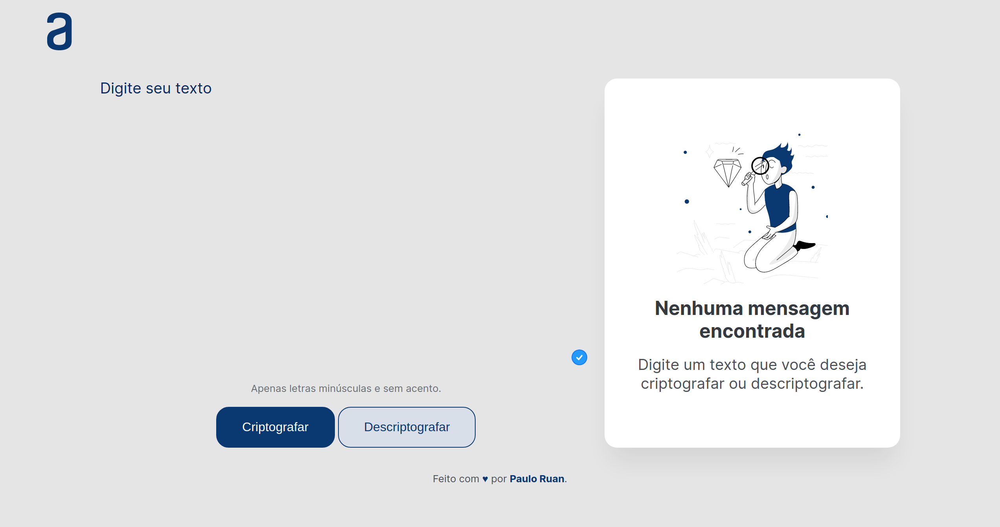

# Decodificador de Texto

  

## Sobre

O Decodificador de Texto é uma aplicação web que permite criptografar e descriptografar mensagens. As "chaves" de criptografia utilizadas são:

- A letra "e" é convertida para "enter."
- A letra "i" é convertida para "imes."
- A letra "a" é convertida para "ai."
- A letra "o" é convertida para "ober."
- A letra "u" é convertida para "ufat."

A aplicação é capaz de converter uma palavra para a versão criptografada e também retornar uma palavra criptografada para a versão original.

## Requisitos

- A aplicação deve funcionar apenas com letras minúsculas.
- Não devem ser utilizados letras com acentos nem caracteres especiais.

## Objetivo do projeto

O projeto é uma atividade do projeto [ONE](https://github.com/alura-challenges/challenge-one-decodificador-br), que tem como objetivo aprimorar as habilidades de desenvolvimento web.
Este projeto tem como objetivo atestar e solidificar o aprendizado adquirido durante o módulo de JavaScript, em manipulação de páginas web utilizando JavaScript.
